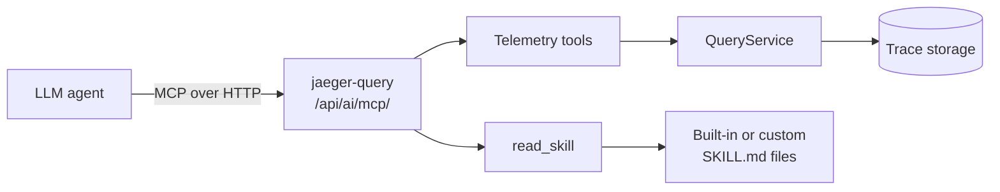
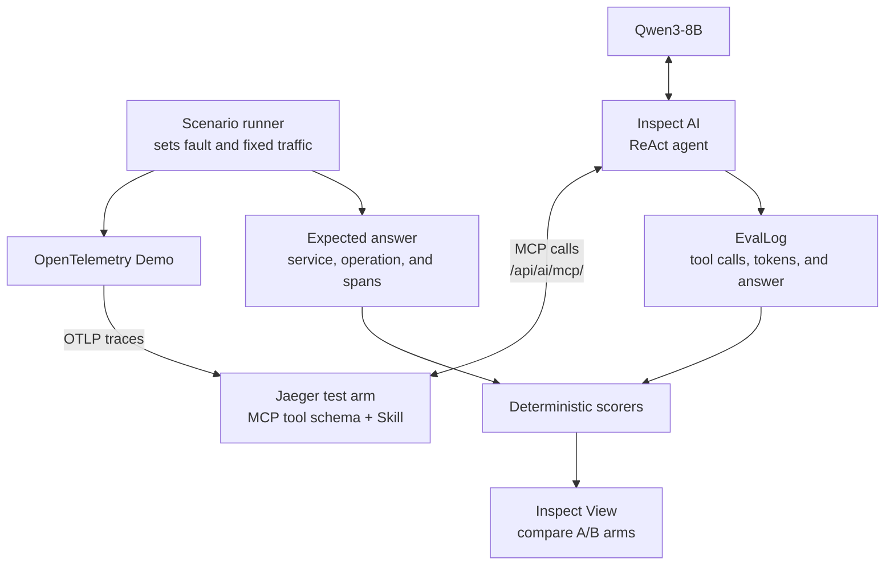

# Benchmarking the Jaeger AI Assistant's MCP Tools and Skills

**Applicant:** Sarva Dubey ([@HESleagacy](https://github.com/HESleagacy))  
**Program:** LFX Mentorship 2026 Term 3 (September-November)  
**Project:** LFX Mentorship 2026 Term 3, Project #2027 ([tracking issue #9135](https://github.com/jaegertracing/jaeger/issues/9135))

## Motivation and Fit

My interest in Jaeger was shaped by mentors who had previously participated in projects connected to Prometheus, Kyverno, LitmusChaos, Kubestellar, and LLVM. They introduced me to CNCF and LFX Mentorship, and Jaeger stood out because of its connection to observability and MLOps. I have already worked in Jaeger’s development workflow through merged [PR #8825](https://github.com/jaegertracing/jaeger/pull/8825) and active [PR #9102](https://github.com/jaegertracing/jaeger/pull/9102) and [PR #9324](https://github.com/jaegertracing/jaeger/pull/9324), gaining experience with the codebase, review workflow, and project conventions.

I currently intern at a startup where I create benchmarking tasks for frontier AI models, particularly for software-engineering tasks. This experience is directly relevant to designing controlled scenarios, evaluation criteria, and reproducible agent trials. I also study machine learning through Andrej Karpathy’s material and Andrew Ng’s CS229 course.

I can commit 30 hours per week during the term alongside my internship, with fixed weekly blocks reserved for the mentorship. I will maintain weekly goals, keep a dated progress log, raise design questions on the tracking issue, and submit small, reviewable PRs.


## Project Understanding



### Requirements

**Maintainer need:** Unit tests can verify that an MCP tool or Skill works as
implemented, but not whether the change helps an LLM investigate traces. When a
PR changes `get_trace_topology` or `error-root-cause/SKILL.md`, maintainers need
a repeatable comparison of accuracy, tool-call errors, steps, and context cost
before accepting it as an improvement.

### Summary

| Area | Details |
|---|---|
| Current interface | Jaeger’s query extension exposes nine telemetry and Skill tools. |
| Shared endpoint | The tools are available through the shared streamable-HTTP endpoint: `/api/ai/mcp/`. |
| Skill loading | `read_skill` progressively loads Markdown playbooks such as `error-root-cause` and `detect-n-plus-one`. |
| Evaluation focus | The goal is not merely to check whether an LLM produces a plausible explanation. |
| Key question | Which tool contracts and Skill instructions help the LLM reach trace-supported evidence accurately? |
| Success criteria | Fewer failures, stronger evidence, and lower context usage. |


## 1. Isolating Trace-Solvable Incidents

A scenario is **trace-solvable** when its cause can be found using Jaeger traces
and trace-derived metrics, without application logs or source code. The expected
answer should name the service and operation involved and point to the spans that
support it. If traces show where a request slowed down but not why, the agent
should say that the available evidence is insufficient instead of guessing.

I will verify each scenario in four steps:

1. Enable one OpenTelemetry Demo fault and generate the same traffic several
   times.
2. Repeat the traffic with the fault disabled and compare the traces.
3. Record the expected service, operation, and supporting span evidence as the
   answer for that scenario.
4. Keep the scenario only if the same answer can be reached consistently using
   the Jaeger MCP tools alone.

The starting set will include `cartFailure`, `paymentFailure`,
`paymentUnreachable`, `adFailure`, `imageSlowLoad`, and
`intlShippingSlowdown`. I will first validate one end-to-end scenario, then expand
to 5-8 scenarios only if the evidence gate remains stable. For example, with
`paymentUnreachable` enabled, the agent should identify the failed
checkout-to-payment call and cite its error spans; the same traffic with the flag
disabled should not produce that diagnosis.

Demo flags will be checked before use because their behavior can change between versions.
Failures that require logs or host-level data, such as memory leaks or CPU
problems, will not be included unless traces clearly contain enough information.
Healthy or incomplete cases will also check whether the agent avoids making
unsupported claims. The final suite will contain 5-8 verified scenarios if the
initial vertical slice supports reliable expansion.

## 2. Evaluation Loop


### Framework and Model

I will use [Inspect AI](https://inspect.aisi.org.uk/), an open-source evaluation
framework with native HTTP MCP tools, agent loops, custom scorers, complete eval
logs, and a local viewer. This covers execution, capture, scoring, and inspection
without adding a separate agent framework and observability backend.

The primary model will be the Apache-2.0-licensed
[Qwen3-8B](https://huggingface.co/Qwen/Qwen3-8B), served locally through a pinned
vLLM OpenAI-compatible endpoint. It is small enough for repeatable local runs and
is explicitly designed for tool use. I will record the model revision,
quantization, vLLM version, context limit, reasoning mode, decoding settings, and
seed where supported. Five repeated runs per scenario/arm with the same pinned
configuration will expose stochastic variance instead of treating one favorable
trajectory as a result; deterministic scenario setup and readiness checks will be
separated from model-output reproducibility.

### Run and Capture

For every run, the harness will reset the scenario, wait for a deterministic
readiness/evidence preflight, then give the agent the same incident prompt. The
answer contract will be structured:

```json
{
  "service": "...",
  "operation": "...",
  "evidence_span_ids": ["..."],
  "explanation": "...",
  "abstain": false
}
```

Inspect's log will retain every model message and tool call. Additional MCP
instrumentation will record the tool name, arguments, result status, empty
results, serialized response bytes, timestamps, and the Jaeger/config/Skill
hashes. Actual model usage will provide per-turn and cumulative input/output
tokens. This separates the static tool-schema cost from dynamic tool responses
and captures the cost of carrying early responses through later turns.

### Scoring

- **Root-cause accuracy:** exact service + operation match; a correct service with
  the wrong operation is partial, not correct.
- **Evidence validity:** cited spans exist and support the stated conclusion;
  unsupported mechanism claims count as hallucinations.
- **Call error and empty-result rates:** malformed/rejected calls and successful
  but empty calls are reported separately.
- **Steps to evidence:** index of the first call that returned a required
  span-level marker, plus total calls and steps to final answer.
- **Context cost:** static schema tokens, dynamic response bytes/tokens, and
  cumulative model input tokens, not one misleading "bloat" scalar.
- **Trajectory quality:** repeated-call/cycle rate, abstention on negative
  controls, latency, truncation encountered, and termination at the step limit.

Primary correctness will be machine-scored against the manifest using structured
answers, span-existence checks, evidence assertions, and captured trajectories.
Version 1 will not use an LLM judge for correctness; qualitative explanation review
can be added later, after the deterministic scoring path is established.

The first milestone is `1 scenario x 4 arms x 5 repeats = 20 runs`. If the
vertical slice is stable, the expanded experiment will use up to six scenarios,
for a maximum of 120 runs. Runs will be paired by scenario and pinned run
configuration. I will report per-scenario results, medians and IQRs for trajectory
metrics, and bootstrap confidence intervals, while retaining raw trajectories for
review. The server instructions, agent prompt, history policy, MCP limits, model
settings, and traffic will remain constant across arms.

## 3. Variations to Test

### Tool Shape

The baseline keeps today's granular path: `get_trace_errors` and
`get_trace_topology`, followed by `get_span_details` for selected spans. The
topology currently encodes IDs inside `path`:

```json
{
  "spans": [{
    "path": "rootSpanID/parentSpanID/spanID",
    "service": "checkout",
    "span_name": "placeOrder",
    "status": "Error"
  }]
}
```

The comparison arm adds a compact analytical tool such as
`get_error_context`. It aggregates existing query results but returns candidates,
not a pre-decided root cause:

```json
{
  "candidates": [{
    "span_id": "spanID",
    "parent_span_id": "parentSpanID",
    "service": "payment",
    "span_name": "charge",
    "status_message": "unavailable",
    "propagation_depth": 3
  }],
  "total_candidate_count": 2,
  "truncated": false
}
```

This tests whether explicit identifiers, compact error context, and visible
truncation reduce malformed follow-up calls and context without moving the final
decision entirely into Go. Internal query work and bytes will still be counted,
so a composite tool cannot win merely because it hides several calls behind one.
A stretch arm may compare full `SpanDetail` output with a narrow error-focused
schema, directly testing the context-cost concern tracked in
[issue #9330](https://github.com/jaegertracing/jaeger/issues/9330).

### Matching Skill Narratives

Each tool shape receives two Skills with the same output and abstention rules:

```markdown
# Goal-oriented
Identify the trace-supported fault locus. Choose the available tools, cite the
decisive span IDs, and abstain when the evidence does not distinguish a cause.

# Procedural for get_error_context
1. Call get_error_context for the target trace.
2. If results are truncated or ambiguous, inspect topology before concluding.
3. Fetch full details only for the leading candidate spans.
4. Return service, operation, and supporting span IDs.
5. Abstain rather than infer a mechanism absent from those spans.
```

The four arms are granular+goal, granular+procedural,
analytical+goal, and analytical+procedural. This reveals interaction effects: a
better schema may need less prompting, while weaker schemas may benefit more from
strict sequencing. Jaeger's embedded `INSTRUCTIONS.md` remains fixed so its
progressive-disclosure guidance does not silently become another variable.

## 4. Timeline

| Weeks | Phase and output |
|---|---|
| 1-2 | Research only: study current MCP/Skills code, ORCA-bench and RCA methods; compare frameworks; define the solvability gate, metrics, manifests, and experiment protocol with mentor review before production coding. |
| 3-4 | Build scenario orchestration and healthy/fault fixtures; validate one scenario and expand toward 5-8 only if it passes the evidence gate. |
| 5-6 | Implement the direct-MCP Inspect harness, structured answers, trajectory capture, deterministic scorers, and one end-to-end baseline. |
| 7 | Implement and test the analytical tool/schema arm in Go, including limits and truncation signals. |
| 8 | Author goal-oriented and procedural Skill arms and add Skill-level regression tests. |
| 9-10 | Run the paired 2x2 experiment on the validated scenarios, repeat failed infrastructure runs, and audit trajectories. A model/config robustness check is stretch work. |
| 11 | Analyze results, document limitations, and agree with mentors on the evidence-backed default. |
| 12 | Upstream selected MCP/Skill changes with tests and docs; publish the reproducible report and final demo. |

## Risks and Deliverables

- Flaky or ineffective demo flags will fail preflight, not become noisy samples;
  revisions and scenario manifests will be pinned.
- Truncated data will never be scored as efficient context use. Missing count or
  warning signals will be fixed or documented as a controlled limitation.
- Model variance will be handled by paired repeated runs, pinned configurations,
  distributional reporting, and raw-log review, not by selecting the best run.

If the analytical tool arm slips, the minimum deliverable remains the versioned
benchmark, local Inspect harness, deterministic scorers, and tested Skill/tool
comparison. The final output will include the validated 5-8-scenario benchmark,
raw and summary results, an evidence-backed default recommendation, and
upstream-quality tests and documentation.

## References

- [Project issue and requirements](https://github.com/jaegertracing/jaeger/issues/9135)
- [Jaeger mentorship application guidelines](https://www.jaegertracing.io/mentorship/applying/)
- [Current MCP tool registration](https://github.com/jaegertracing/jaeger/blob/096f3f57158a2aa1e96648cf47eb030b63f86836/cmd/jaeger/internal/extension/jaegerquery/internal/mcptools/server.go)
- [Current Skills authoring and loading behavior](https://github.com/jaegertracing/jaeger/blob/096f3f57158a2aa1e96648cf47eb030b63f86836/cmd/jaeger/internal/extension/jaegerquery/internal/mcptools/README.md)
- [OpenTelemetry Demo feature flags](https://opentelemetry.io/docs/demo/feature-flags/)
- [Inspect AI MCP and evaluation documentation](https://inspect.aisi.org.uk/tools-mcp.html)
- [Qwen3-8B model card](https://huggingface.co/Qwen/Qwen3-8B)
- [ORCA-bench: How Ready Are Language Model Agents for Oncall?](https://arxiv.org/abs/2607.28545)

---
