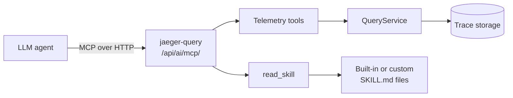
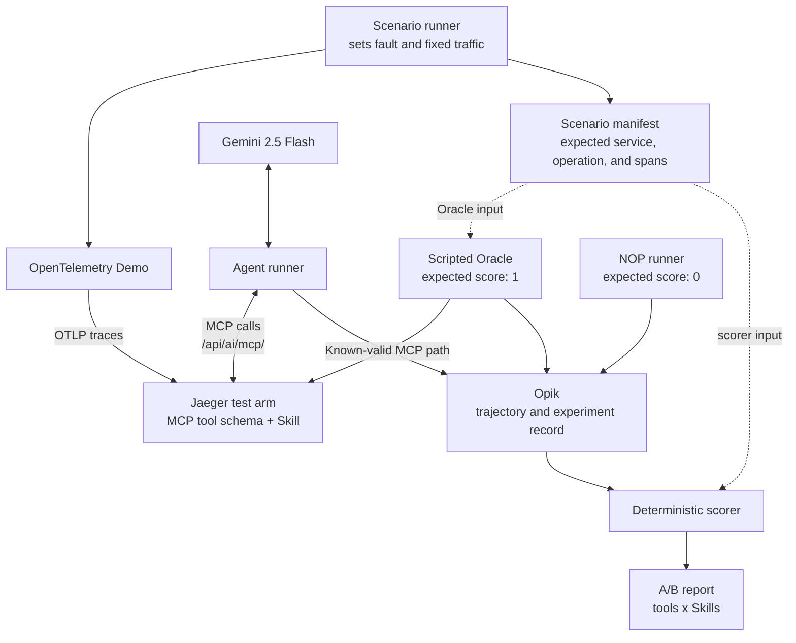

# Benchmarking the Jaeger AI Assistant's MCP Tools and Skills

**Applicant:** Sarva Dubey ([@HESleagacy](https://github.com/HESleagacy))  
**Program:** LFX Mentorship 2026 Term 3 (September-November)  
**Project:** LFX Mentorship 2026 Term 3, Project #2027 ([tracking issue #9135](https://github.com/jaegertracing/jaeger/issues/9135))

## Motivation and Fit

My interest in Jaeger was shaped by mentors who had previously participated in
projects connected to Prometheus, Kyverno, LitmusChaos, KubeStellar, and LLVM.
They introduced me to CNCF and LFX Mentorship, and Jaeger stood out because of
its connection to observability and MLOps. I have already worked in Jaeger's
development workflow through merged
[PR #8825](https://github.com/jaegertracing/jaeger/pull/8825) and active
[PR #9102](https://github.com/jaegertracing/jaeger/pull/9102) and
[PR #9324](https://github.com/jaegertracing/jaeger/pull/9324), gaining experience
with the codebase, review workflow, and project conventions.

I currently intern at a startup where I create benchmarking tasks for frontier
AI models, particularly for software-engineering tasks. This experience is
directly relevant to designing controlled scenarios, evaluation criteria, and
reproducible agent trials. I also study machine learning through Andrej Karpathy's material and Andrew
Ng's CS229 course.

I can commit 30 hours per week during the term alongside my internship, with
fixed weekly blocks reserved for the mentorship. I will maintain weekly goals,
keep a dated progress log, raise design questions on the tracking issue, and
submit small, reviewable PRs.

## Project Understanding



### Requirements

**Maintainer need:** Unit tests can verify that an MCP tool or Skill works as
implemented, but not whether the change helps an LLM investigate traces. When a
PR changes `get_trace_topology` or `error-root-cause/SKILL.md`, maintainers need
a repeatable comparison of accuracy, tool-call errors, steps, and context cost
before accepting it as an improvement.

### Summary

| Area | Details |
|---|---|
| Current interface | Jaeger's query extension exposes nine telemetry and Skill tools. |
| Shared endpoint | The tools are available through the shared streamable-HTTP endpoint: `/api/ai/mcp/`. |
| Skill loading | `read_skill` progressively loads Markdown playbooks such as `error-root-cause` and `detect-n-plus-one`. |
| Evaluation focus | The goal is not merely to check whether an LLM produces a plausible explanation. |
| Key question | Which tool contracts and Skill instructions help the LLM reach trace-supported evidence accurately? |
| Success criteria | Fewer failures, stronger evidence, and lower context usage. |

## 1. Isolating Trace-Solvable Incidents

A scenario is **trace-solvable** when its cause can be found using Jaeger traces
and trace-derived metrics, without application logs or source code. The expected
answer should name the service and operation involved and point to the spans that
support it. If traces show where a request slowed down but not why, the agent
should say that the available evidence is insufficient instead of guessing.

I will verify each scenario in four steps:

1. Enable one OpenTelemetry Demo fault and generate the same traffic several
   times.
2. Repeat the traffic with the fault disabled and compare the traces.
3. Record the expected service, operation, and supporting span evidence as the
   answer for that scenario.
4. Keep the scenario only if the same answer can be reached consistently using
   the Jaeger MCP tools alone.

The starting set will include `cartFailure`, `paymentFailure`,
`paymentUnreachable`, `adFailure`, `imageSlowLoad`, and
`intlShippingSlowdown`. For example, with `paymentUnreachable` enabled, the agent
should identify the failed checkout-to-payment call and cite its error spans; the
same traffic with the flag disabled should not produce that diagnosis. Demo flags
will be checked before use because their behavior can change between versions.
Failures that require logs or host-level data, such as memory leaks or CPU
problems, will not be included unless traces clearly contain enough information.
Healthy or incomplete cases will also check whether the agent avoids making
unsupported claims. The final suite will contain 5-8 verified scenarios.

## 2. Evaluation Loop



### Framework and Model

I will use self-hosted [Opik](https://github.com/comet-ml/opik) to store and compare
experiments. A small Python runner will call Jaeger's shared MCP endpoint and
record each model turn and tool call as an Opik trace.

The model will be **Gemini 2.5 Flash**, matching Jaeger's existing Gemini
sidecar. I will pin the model name, prompt, tool manifest, Jaeger commit,
configuration, and generation settings for every run. Five repeated runs per arm
will show variation instead of treating one favorable run as a result.

### Run and Capture

For every run, the harness will reset the scenario, wait for a deterministic
readiness/evidence preflight, then give the agent the same incident prompt. The
answer contract will be structured:

```json
{
  "service": "...",
  "operation": "...",
  "evidence_span_ids": ["..."],
  "explanation": "...",
  "abstain": false
}
```

Opik will retain every model turn and tool call. The runner will record tool name,
arguments, result status, empty results, response bytes, timestamps, token usage,
and the Jaeger/config/Skill hashes.

### Scoring

- **Root-cause accuracy:** exact service + operation match; a correct service with
  the wrong operation is partial, not correct.
- **Evidence validity:** cited spans exist and support the stated conclusion;
  unsupported mechanism claims count as hallucinations.
- **Call error and empty-result rates:** malformed/rejected calls and successful
  but empty calls are reported separately.
- **Steps to evidence:** index of the first call that returned a required
  span-level marker, plus total calls and steps to final answer.
- **Context cost:** static schema tokens, dynamic response bytes/tokens, and
  cumulative model input tokens, not one misleading "bloat" scalar.
- **Trajectory quality:** repeated-call/cycle rate, abstention on negative
  controls, latency, truncation encountered, and termination at the step limit.

Before model trials, the scripted Oracle must score `1` and the NOP runner must
score `0`. If either check fails, the scenario or scorer is invalid. The scenario
manifest is available only to the Oracle and scorer; Gemini sees only the incident
prompt and Jaeger MCP responses.

Primary correctness is machine-scored against the manifest. The first milestone
is one validated scenario, Oracle/NOP checks, and `4 arms x 5 repeats = 20` Gemini
runs. After that works end to end, I will expand to 5-8 scenarios. Results will be
reported per scenario with medians and ranges; raw Opik traces remain available
for review. Prompts, limits, model settings, and traffic stay fixed across arms.

## 3. Variations to Test

### Tool Shape

The baseline keeps today's granular path: `get_trace_errors` and
`get_trace_topology`, followed by `get_span_details` for selected spans. The
topology currently encodes IDs inside `path`:

```json
{
  "spans": [{
    "path": "rootSpanID/parentSpanID/spanID",
    "service": "checkout",
    "span_name": "placeOrder",
    "status": "Error"
  }]
}
```

The comparison arm adds a compact analytical tool such as
`get_error_context`. It aggregates existing query results but returns candidates,
not a pre-decided root cause:

```json
{
  "candidates": [{
    "span_id": "spanID",
    "parent_span_id": "parentSpanID",
    "service": "payment",
    "span_name": "charge",
    "status_message": "unavailable",
    "propagation_depth": 3
  }],
  "total_candidate_count": 2,
  "truncated": false
}
```

This tests whether explicit identifiers, compact error context, and visible
truncation reduce malformed follow-up calls and context without moving the final
decision entirely into Go. Internal query work and bytes will still be counted,
so a composite tool cannot win merely because it hides several calls behind one.
A stretch arm will compare full `SpanDetail` output with a narrow error-focused
schema, directly testing the context-cost concern tracked in
[issue #9330](https://github.com/jaegertracing/jaeger/issues/9330).

### Matching Skill Narratives

Each tool shape receives two Skills with the same output and abstention rules:

```markdown
# Goal-oriented
Identify the trace-supported fault locus. Choose the available tools, cite the
decisive span IDs, and abstain when the evidence does not distinguish a cause.

# Procedural for get_error_context
1. Call get_error_context for the target trace.
2. If results are truncated or ambiguous, inspect topology before concluding.
3. Fetch full details only for the leading candidate spans.
4. Return service, operation, and supporting span IDs.
5. Abstain rather than infer a mechanism absent from those spans.
```

The four arms are granular+goal, granular+procedural,
analytical+goal, and analytical+procedural. This reveals interaction effects: a
better schema may need less prompting, while weaker schemas may benefit more from
strict sequencing. Jaeger's embedded `INSTRUCTIONS.md` remains fixed so its
progressive-disclosure guidance does not silently become another variable.

## 4. Timeline

| Weeks | Phase and output |
|---|---|
| 1-2 | Lock one scenario, answer manifest, metrics, and Oracle/NOP checks with mentor review before changing production code. |
| 3-5 | Build the Python MCP runner, Opik capture, deterministic scorer, and first 20 Gemini trials. |
| 6-8 | Implement the tool-shape and Skill variants with focused Go and Skill tests. |
| 9-10 | Expand only validated scenarios and run the fixed 2x2 comparison. |
| 11-12 | Select the best default, upstream the supported changes, and publish raw traces, report, tests, and documentation. |

## Risks and Deliverables

- Flaky or ineffective demo flags will fail preflight, not become noisy samples;
  revisions and scenario manifests will be pinned.
- Truncated data will never be scored as efficient context use. Missing count or
  warning signals will be fixed or documented as a controlled limitation.
- Model variation will be handled by repeated runs and raw Opik-trace review, not
  by selecting the best run.

The final output will include the versioned 5-8-scenario benchmark, Python MCP
runner with self-hosted Opik, tested Go and Skill variants, raw/summary results,
an evidence-backed default recommendation, and upstream-quality tests and
documentation.

## References

- [Project issue and requirements](https://github.com/jaegertracing/jaeger/issues/9135)
- [Jaeger mentorship application guidelines](https://www.jaegertracing.io/mentorship/applying/)
- [Current MCP tool registration](https://github.com/jaegertracing/jaeger/blob/096f3f57158a2aa1e96648cf47eb030b63f86836/cmd/jaeger/internal/extension/jaegerquery/internal/mcptools/server.go)
- [Current Skills authoring and loading behavior](https://github.com/jaegertracing/jaeger/blob/096f3f57158a2aa1e96648cf47eb030b63f86836/cmd/jaeger/internal/extension/jaegerquery/internal/mcptools/README.md)
- [OpenTelemetry Demo feature flags](https://opentelemetry.io/docs/demo/feature-flags/)
- [Opik open-source evaluation platform](https://github.com/comet-ml/opik)
- [Jaeger's Gemini 2.5 Flash sidecar](https://github.com/jaegertracing/jaeger/tree/main/scripts/ai-sidecar/gemini)

---
